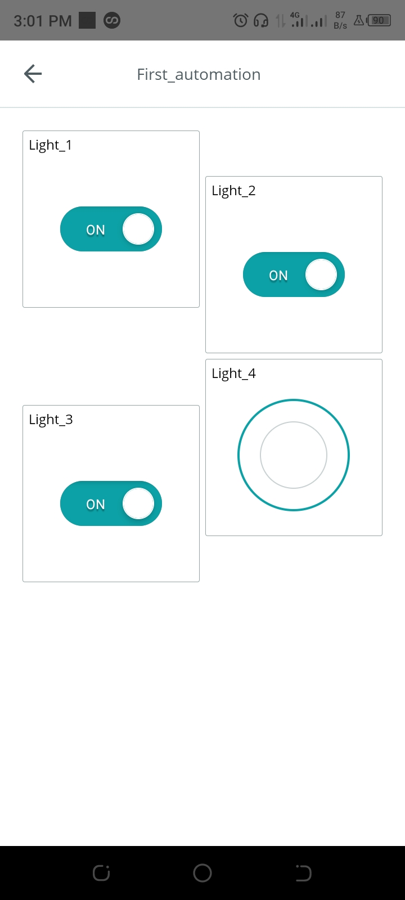

# Smart Home System
Author: Rufus  
Date: 21/09/2022  
Revision: 0.0.1v  
License: Public Domain 

## What the project does
This is a Smart Home project that allows you to operate your house appliances remotely (i.e from anywhere in the world). 
The project allows you to control the on anf off state of four different house gadget remotely.

    

## Step 1: Installation
1. Open this file  
2. Edit as you like (the comments in the code will help you)

## Step 2: Assemble the circuit

Assemble your circuit rightly

## Step 3: Load the code

Upload the code contained in this sketch on to your board

## License
This project is released under a {License} License.

## Contributing
To contribute to this project please contact Rufus @  
otruke1@gmail.com